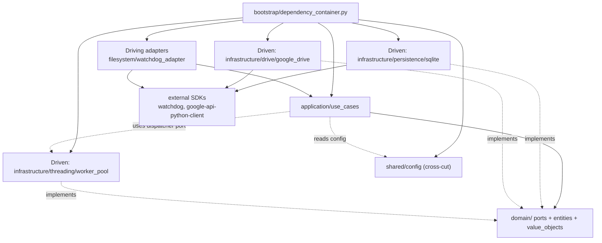

# ADR-001: Hexagonal / Ports & Adapters

**Date:** 2026-07-02
**Status:** Accepted
**Deciders:** Project team
**Supersedes:** —

## Context

`drive-uploader` is a monolithic Python 3.11 service that watches a local folder and uploads new files to Google Drive. It runs as a long-lived foreground process and uses a SQLite-backed durable queue plus a thread-pool worker pool so concurrent uploads survive crashes without losing or double-uploading files.

The team is solo/pair (Q3:A). The business domain is moderate — CRUD-ish file uploads with retries, stable-file detection, scan-existing-folder — not rich enough to justify DDD, but layered enough that business rules (state transitions, backoff, idempotency) should sit in code that is independent of Drive, SQLite and watchdog. The deployment is "single binary + DB file + watched folder" with one operator; there are no autonomous teams or separate deploy boundaries to motivate service splitting.

An audit performed on 2026-07-02 against this ADR's predecessor-content in `CLAUDE.md ## Architecture` confirmed that the de-facto code organisation already matches the hexagon — `domain/` imports nothing else, `application/use_cases/` depends only on `domain/ports`, and `bootstrap/dependency_container.py` is the only place where core and adapters are wired together. This ADR formalises that decision, names `shared/` as an intentional cross-cutting package, records the seams that still need repair, and replaces the informal description in `CLAUDE.md` with prescriptive rules.

## Decision

We adopt **Hexagonal / Ports & Adapters** for `drive-uploader`.

Concretely:

- `domain/` owns the core model (`UploadJob`, `UploadStatus`) and the ports (`DriveUploaderPort`, `QueueRepositoryPort`, future `UploadDispatcherPort`). It imports nothing outside stdlib + sibling `domain/` modules.
- `application/use_cases/` orchestrates business behaviour (`EnqueueFile`, `UploadFile`, `ProcessQueue`) and depends only on `domain/` ports and `shared/config.py`. It is unaware of Drive, SQLite and watchdog.
- `infrastructure/` holds the four adapter families:
  - **driving** (`filesystem/watchdog_adapter.py`) — anything that triggers the app.
  - **driven persistence** (`persistence/sqlite_repository.py`) — implements `QueueRepositoryPort`.
  - **driven external** (`drive/google_drive_adapter.py`) — implements `DriveUploaderPort`.
  - **driven process** (`threading/worker_pool.py`) — implements the future `UploadDispatcherPort`.
- `bootstrap/dependency_container.py` is the **only** layer that imports from both core and adapters; it owns composition and lifecycle (`start()` / `stop()`, SIGINT/SIGTERM).
- `shared/config.py` is the only allowed non-hexagonal top-level package — it carries env-driven `Settings` and is treated as cross-cutting. Application use cases read it directly; we do not port-ify environment configuration because env-loading is not a behaviour boundary in this project.

Ports use `typing.Protocol` (structural typing), not `abc.ABC`. In a 14-file project the lighter form is the right call; nominal-typing safety would add boilerplate without buying testability we don't have.

## Considered alternatives

| Alternative | Score | Reason not chosen |
|---|---:|---|
| **Hexagonal / Ports & Adapters (chosen)** | 7/7 ★★★★★ | Matches Q1:C-style adapter fronts (Drive, filesystem, queue), Q3:A solo, Q2:B moderate, Q4:B maintainability |
| Clean Architecture | 5/7 ★★★★☆ | Strong on Q4:B/C but the heavier `usecases/ + adapters/ + frameworks/` split overlaps with our 3-package hexagon; ceremony without new separation |
| Modular Monolith | 4/7 ★★★☆☆ | No module boundaries exist in the domain (single capability); premature |
| Microservices | 1/7 ★★☆☆☆ | Q3:A + Q5:A hit "avoid when" (-2); single team + one capability does not justify per-capability deploys |
| Layered (N-Tier) | 1/7 ★★☆☆☆ | Q2 hits avoid-when (-2); persistence/transport leaking through is the very thing the hexagon fixes |

Scores follow the architecture-advisor rubric applied to the project's answers on 2026-07-02.

## Consequences

**Positive**
- (Q4:B) Swapping the persistence layer (e.g. Postgres, file-based queue) is implementing `QueueRepositoryPort`, not touching use cases.
- (Q4:B) Adding a second upload target (S3, Azure Blob) is implementing `DriveUploaderPort`.
- (Q4:C) Protocol-based ports → use-case tests run against hand-written in-memory fakes (`tests/conftest.py`), no mocking library.
- (Q4:A) Single composition root keeps `bootstrap/main.py` at ~18 lines.

**Negative**
- One-method ports can leak as just-delegated shapes (see `WorkerPoolPort` in the migration plan) — minor indirection tax until the abstraction earns its keep.
- One known documentation drift must be resolved (Service Account vs OAuth).
- Polling dispatcher is a simplification, marked with a `# ponytail:` comment naming the upgrade trigger.

## Implementation notes

### Folder structure (current)

```
src/
├── domain/
│   ├── entities/upload_job.py            # UploadJob dataclass
│   ├── value_objects/upload_status.py     # UploadStatus enum
│   └── ports/
│       ├── drive_uploader.py              # DriveUploaderPort (Protocol)
│       ├── queue_repository.py            # QueueRepositoryPort (Protocol)
│       └── worker_pool.py                 # legacy; replaced by UploadDispatcherPort (M4)
├── application/use_cases/
│   ├── enqueue_file.py                    # depends only on domain/ports
│   ├── process_queue.py                   # dispatcher (will depend on UploadDispatcherPort after M4)
│   └── upload_file.py                     # upload + retry + backoff
├── infrastructure/
│   ├── filesystem/watchdog_adapter.py     # driving
│   ├── persistence/sqlite_repository.py   # driven
│   ├── drive/google_drive_adapter.py      # driven
│   └── threading/worker_pool.py           # driven process
├── shared/config.py                       # cross-cutting Settings
└── bootstrap/
    ├── dependency_container.py            # composition root
    └── main.py                            # entrypoint
tests/
├── conftest.py                            # InMemoryQueueRepository, FakeUploader
├── test_enqueue_file.py
├── test_upload_file.py
└── test_sqlite_repository.py              # runs against real SQLite
```

### Enforceable rules

Each rule maps to a checkable import-linter contract. They are mechanical, not aspirational.

1. `domain/` may import only stdlib and sibling `domain/` modules — never `application/`, `infrastructure/`, `bootstrap/` or `shared/`.
2. `application/` may import `domain/` and `shared/`, plus stdlib and external libraries. Never `infrastructure/` or `bootstrap/`.
3. `infrastructure/` may import `domain/`, `shared/`, stdlib and external libraries. Adapters do not import one another (one import path one direction).
4. `bootstrap/` is the only package that may import from every other top-level package. It contains the composition root and the entrypoint only.
5. New top-level packages under `src/` require an ADR update before they are merged. The allowed top-levels are `domain/`, `application/`, `infrastructure/`, `shared/`, `bootstrap/`, plus `tests/`.
6. Use cases receive their dependencies via constructor injection (already true; verified by `tests/conftest.py`).

Linter wiring (deferred, see M6) will use `import-linter` with two contracts:
- `hex-layers`: layering `bootstrap → infrastructure → shared → application → domain`.
- `core-knows-no-adapters`: forbidden import paths `domain.* → infrastructure.*` and `application.* → infrastructure.*`.

### Migration plan

Findings from the 2026-07-02 audit, ordered by leverage and smallest blast radius.

| Step | Action | Status | Severity | Trigger to defer |
|---|---|---|---|---|
| **M1** | In `application/use_cases/upload_file.py`: move `repository.update(DONE)` BEFORE the `unlink` to keep idempotency on crash. Remove unused `UploadStatus.NEW`. | done | MED + LOW | none — trivial, do now |
| **M2** | In `bootstrap/dependency_container.py`: register `signal.signal` handlers **before** any thread is spawned. Bound `ProcessQueue.stop` with a `shutdown_timeout` so `SIGTERM` does not block mid-upload. | done | MED ×2 | none — trivial |
| **M3** | Resolve Service-Account-vs-OAuth drift. Update the auth line in `CLAUDE.md` to match the actual code (decide: keep `InstalledAppFlow` OR rewrite `_credentials` to use Service Account). | todo | MED | needs a product decision — is interactive first-run acceptable for this service? |
| **M4** | Replace `WorkerPoolPort.submit(fn, *args)` with `UploadDispatcherPort.process(job) -> None` in `domain/ports/`. Move the `ThreadPoolExecutor` into an adapter so `ProcessQueue` no longer passes raw callables through a port that adds zero abstractive value. | done | MED | small enough to do now; do it together with M1+M2 |
| **M5** | Introduce `OnFileDetectedPort` in `domain/ports/`; `FolderWatcher` depends on the port, not the concrete `EnqueueFile`. | done | LOW | trigger: a second driving adapter appears (REST re-enqueue endpoint, scheduled retry job, CLI subcommand) |
| **M6** | Wire `import-linter` in CI with the layering contracts. Switched source imports to the `src.` prefix so grimp can resolve the dependency graph (otherwise the linter reports "0 dependencies" and the contracts silently pass). | done | LOW | trigger: before the first PR that touches `domain/` or `application/` |

## Architecture diagram



Arrows are dependency direction. Solid arrows for runtime calls; dotted arrows for "implements port" or "reads configuration" relationships.

## Review triggers

- Team passes 4 engineers → re-open module-per-capability inside `domain/` (prelude to splitting the service later).
- A second upload target appears (S3, Azure Blob) → confirm `DriveUploaderPort` shape; should hold up as-is.
- Per-upload throughput becomes the bottleneck rather than the network → revisit dispatcher (M5 trigger) and the SQLite single-write-lock (`# ponytail:` trigger documented in `sqlite_repository.py:35`).
- A non-watchdog enqueueing source is added (HTTP endpoint, scheduled re-run) → drive M5 (`OnFileDetectedPort`).
- A second business capability joins the service (e.g. download + transform pipeline) → split the repo and revisit this ADR.
